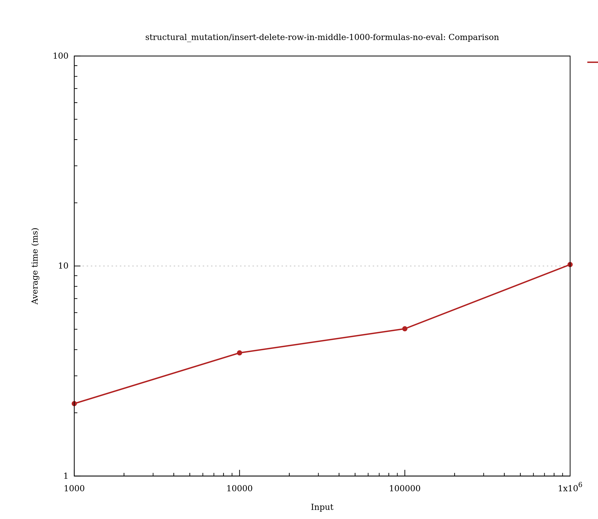
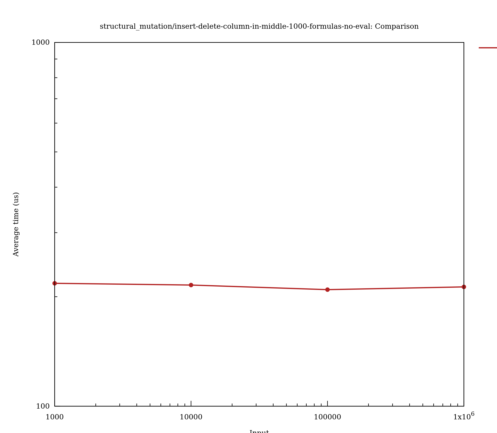
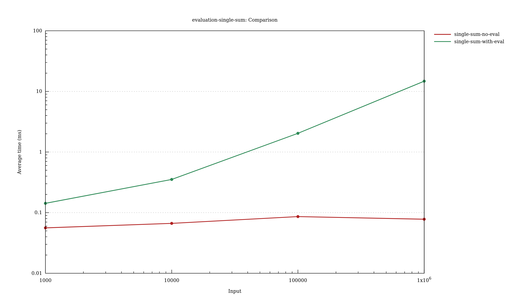

# Sheeit

An **_experimental_** blazing-fast spreadsheet engine that supports thousands of concurrent users and millions of cells.

## Sheeit, really?

Imagine your typical Google Sheets, except that you can have thousands of users working together on the same sheet at the same time, and the sheet contains tens of millions to billions(maybe) of cells.

Sheeit is **_one part_** of that picture.

Sheeit is a library that handles storing data and evaluating formulas in a spreadsheet. It does not provide a frontend UI, nor a web server to serve API requests.

Sheeit can be thought of as an in-memory database engine, except it is highly-optimized for spreadsheet use cases.

## Sheeit, how?

Sheeit relies on **4 key architectural pillars** to provide blazing-fast performance:

1. Allow for thousands of concurrent reads (and maybe writes).

   Reads never block. By leveraging immutable data structures, each reader gets their own copy of the document.

   Writes are single-threaded per-document today. Allowing for concurrent writes is a goal in the future. However, writes are usually extremely fast because no expensive operations happen during writes.

1. Every type of data-manipulation operations are fast.

   Unlike traditional databases, it's common for users to insert/delete rows and columns _at any place in the sheet_. Or insert data into random cells and generally have an unstructured and flexible approach to data. The former is especially a performance killer for traditional approaches.

   However, Sheeit uses immutable data structures to solve the issue. Sheeit also leverages its in-memory architecture to accomodate flexible forms of data.

1. Evaluation is only performed when necessary.

   Similar to modern spreadsheet systems like Excel, Sheeit only re-evaluates a formula if it or some data it depends on have changed.

1. Evaluation is performed concurrently.

   Almost all spreadsheet systems today block writes until all evaluation is complete. Problem is, certain formulas take a long time to evaluate. This results in application hangs and freezes, and the spreadsheet generally not being responsive.

   Sheeit performs evaluation in the background concurrently, and has a bunch of smarts to ensure (eventual) consistency.

## Show me some numbers

All runs are made on a machine with an AMD 1800X (default-clocked) 8-core, 16-thread processor, and 32GB of 3200Mhz RAM.

### Write throughput with different number of readers/writers

| Readers | Writers | Reads/s | Writes/s | Total Throughput/s |
| ------- | ------- | ------- | -------- | ------------------ |
| 1       | 1       | 1882    | 7162     | 9044               |
| 2       | 1       | 4924    | 7249     | 12173              |
| 4       | 1       | 4742    | 7237     | 11979              |
| 8       | 1       | 13215   | 6982     | 20197              |
| 16      | 1       | 31760   | 7020     | 38780              |
| 1       | 2       | 414     | 5834     | 6248               |
| 1       | 4       | 184     | 4920     | 5104               |
| 1       | 8       | 95      | 4941     | 5036               |
| 1       | 16      | 49      | 4902     | 4951               |
| 8       | 8       | 725     | 4786     | 5511               |

As you can see, we achieve the **_highest throughput_** by allowing for multiple reader threads and a single writer thread. This is not enforced in the library today (but can be).

38.7K ops/sec (31.7K reads, 7K writes) is the _current_ max throughput, but I think I can improve it by another order of magnitude.

### Latencies on Insert and Delete Rows and Columns

Experimenting with 10 columns. x-axis is number of rows.

Note that the x-axis is **_logarithmic_**. We see here that inserting and deleting a row in the middle with 1M rows (10M cells) takes only 10ms. Since Sheeit is column-oriented, inserting and deleting a column is even faster, at a constant ~250us.

### Benefits of Concurrent Evaluation

Using concurrent evaluation, control is immediately returned to the user in under 0.1ms regardless of dataset size. With evaluation, the latency can be tied to dataset size and evaluation complexity.

## But seriously, this is experimental

These are the things you can expect for this project due to its experimental nature:

- Less rigorous and comprehensive testing. Bugs will be encountered.
- Less emphasis on providing full compatibility with Excel with many functions not implemented. (For the functions that I _do_ implement though, I strive to be compatible with Excel)
- APIs that are not ergonomically designed.
- APIs that change frequently.
- Common usage scenarios are not supported or under-supported. (e.g. import/exports are not prioritized right now)
- Documentation are lacking.

That said, the points above applies if I'm the sole contributor. I'm willing to make changes to prioritization with contribution help.

## FAQ

#### How can I use it?

The short answer is: You most likely can't.

There aren't any frontend UI today that integrates with this library. If you're planning to integrate with this library, note that this library is still experimental. Contact me on discussing ideas on how you might be able to put this on the path to production.

#### Why not include a UI or web server?

Actual spreadsheet applications are extremely feature rich (think PivotTable, charts etc). They require a lot of time and resources to develop.
However, the _concepts_ of a spreadsheet are fairly simple (that's why people love them in the first place). Sheeit is an attempt to implement these concepts that can work well with large data sizes and highly concurrent workloads.

#### Why not just use a database?

I think there are 2 possible interpretations to this question:

1. Why not use a database instead of a spreadsheet?

   A database does not allow for the visual, intuitive manipulation of data and computation of data together. Spreadsheets have been around for decades and the world still runs on it because it's extremely intuitive for people to grasp and use.

   As dataset sizes grow larger however, spreadsheet applications are showing their limitations. Sheeit tries to remove those limitations while preserving the same familiar spreadsheet paradigm.

1. Why not integrate with a database instead of building a completely new spreadsheet engine?

   I think fundamentally a database is a very different paradigm compared to a spreadsheet. Trying to fit a coordinate-based system of spreadsheet into a database comes with a lot of complexity and performance cost. Things like inserting and deleting a column can be extremely expensive in a row-oriented database.

   I also think that this space is up in the air. Maybe taming the complexity and performance of such integration is possible. And I'd be happy to be proven wrong.

## I'd like to Contribute!

Great! I'll take any help I can get. Please go through the [Development Tenets](/TENETS.md) and feel free to either take on an issue, or make any improvements you'd like and submit a PR!
